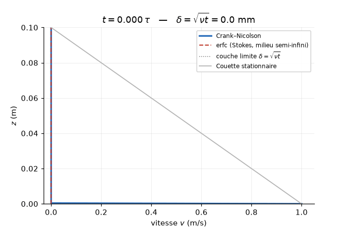
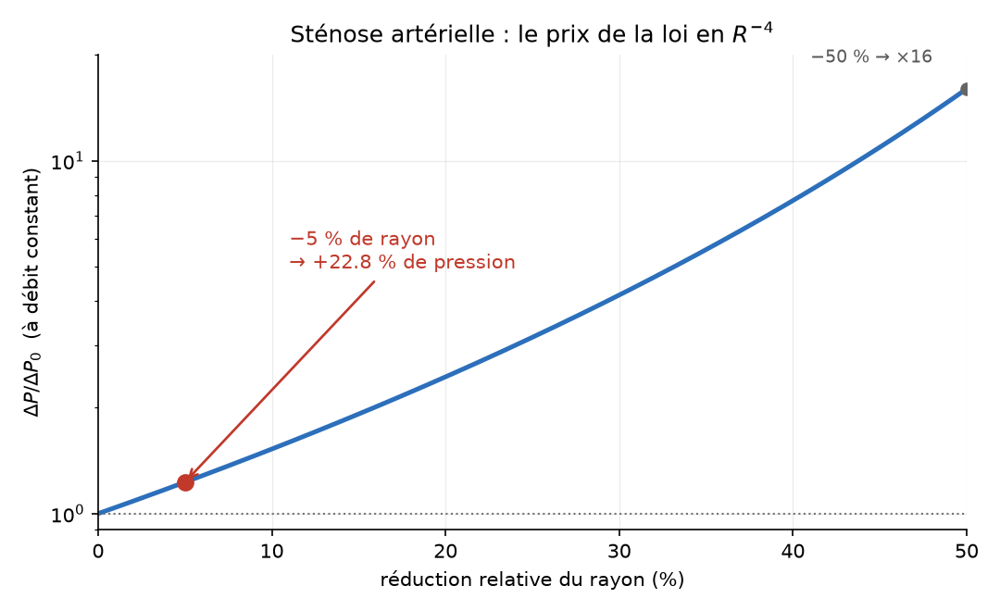
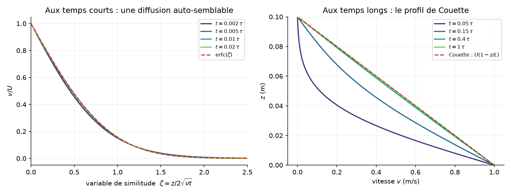
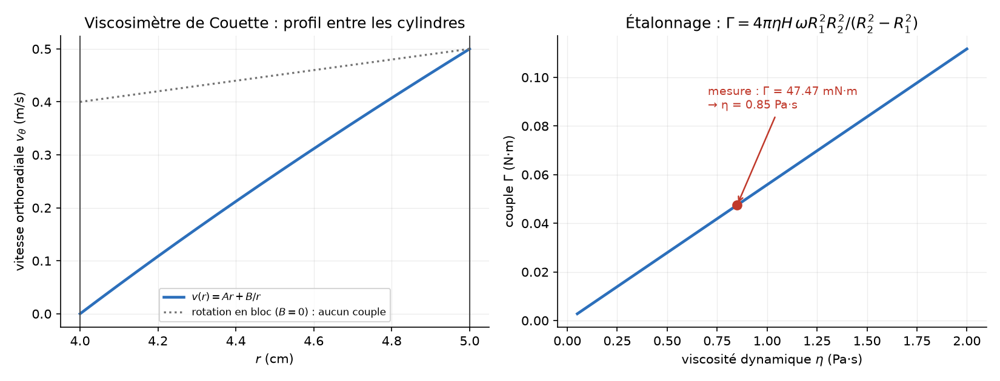
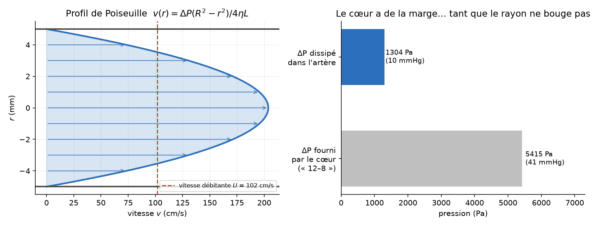
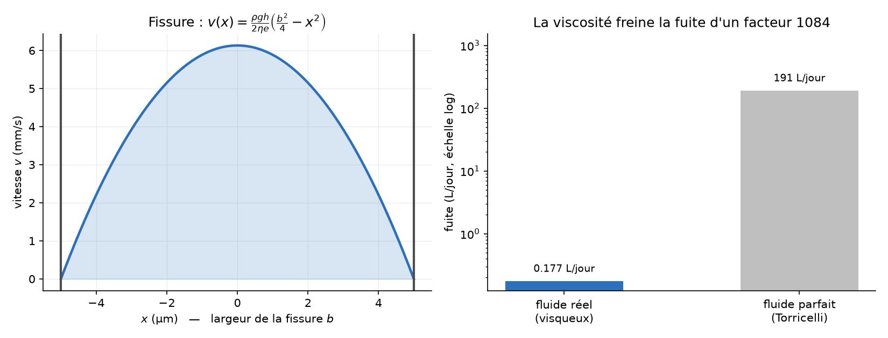
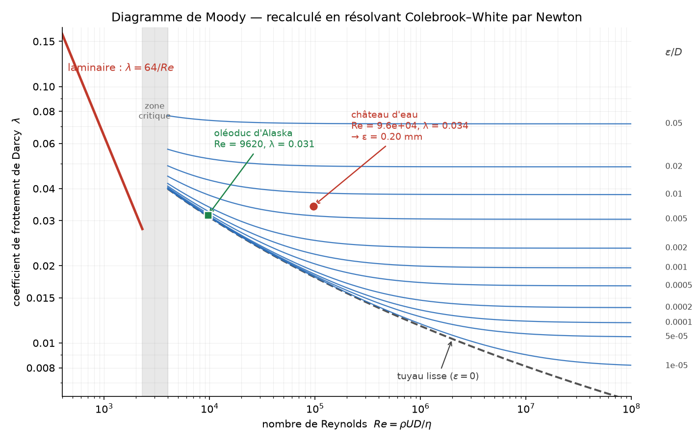
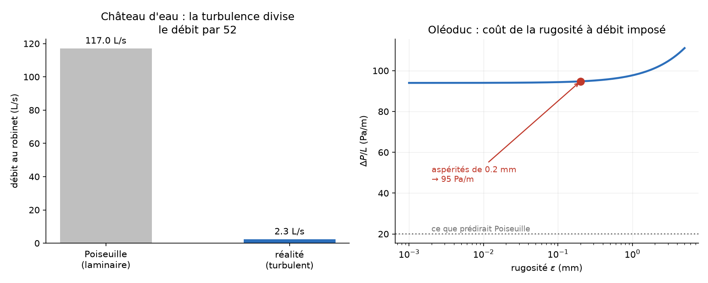
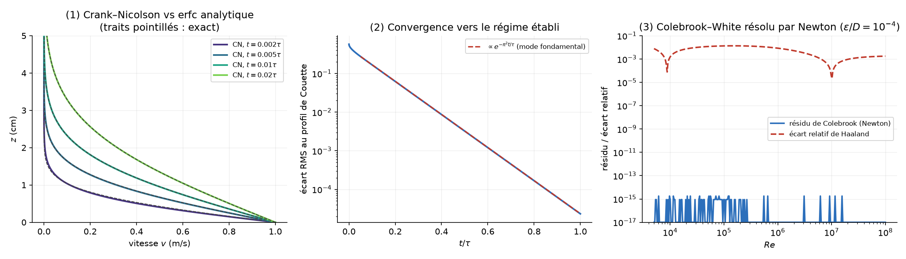

# 🩸 Viscous Flows — from Momentum Diffusion to Head Losses


Simulation of **viscous flows**, from the transient start-up of a plate (a pure
**diffusion of momentum**) to the **Hagen–Poiseuille** law in pipes, and finally to
**turbulent head losses** — with a **Moody diagram recomputed from scratch** by solving
the Colebrook–White equation with Newton's method instead of reading it off a chart.
**Every physical parameter is tunable from the command line.**

<p align="center">
  
  
</p>

The problems come from a *Mécanique des fluides* problem set (real fluids in motion,
PSI). The statements and the full pen-and-paper derivations are written up in
**[enonces.md](enonces.md)** — in French — so you can work them out yourself before
looking at the simulation. Three independent numerical checks validate the solvers
against exact results (see [below](#-sanity-checks)).

---

## 📦 Installation

### Option A — with [`uv`](https://github.com/astral-sh/uv) (recommended)

```bash
git clone <repo-url> && cd viscous-flows
uv run main.py                # creates the env, installs deps, runs — all in one
```

> Don't have uv yet? `curl -LsSf https://astral.sh/uv/install.sh | sh` (or `brew install uv`).

### Option B — with plain `pip`

```bash
git clone <repo-url> && cd viscous-flows
python -m venv .venv && source .venv/bin/activate
pip install .
python main.py
```

---

## ▶️ The four demos

```bash
# 1. Plate set in motion: momentum diffuses through the fluid (MF3-1, MF3-2, MF3-4)
uv run main.py --mode stokes

#    Thicker gap → the steady state takes four times longer (τ = L²/ν)
uv run main.py --mode stokes --gap 0.2

# 2. Pipe flow: the artery and the cracked water tank (MF3-7, MF3-8)
uv run main.py --mode poiseuille --stenosis 0.05

# 3. Head losses: water tower & Alaska pipeline, on a computed Moody chart (MF3-6, MF3-9)
uv run main.py --mode moody

# 4. Sanity checks: numerics vs exact solutions
uv run main.py --mode check
```

Outputs land in `figures/`.

---

## 📐 The physics

### 1. Viscosity is a diffusion coefficient

A momentum balance on a slab of fluid in a unidirectional flow `v(z,t)·ex` gives

$$
\frac{\partial v}{\partial t} = \nu\,\frac{\partial^2 v}{\partial z^2},
\qquad \nu = \frac{\eta}{\rho}
$$

This is **literally the heat equation**, with the kinematic viscosity ν in place of the
thermal diffusivity. Viscosity does not "slow the fluid down": it *diffuses momentum*
from one layer to the next. Everything follows from that analogy — a diffusion time
`τ = L²/ν`, a penetration depth `δ ≈ √(νt)`, and a linear steady profile.

With water (ν = 10⁻⁶ m²/s) across a 10 cm gap, `τ = L²/ν = 10⁴ s ≈ **2 h 45 min**`. It
takes nearly three hours for a moving plate to be felt 10 cm away. Momentum diffusion is
*slow*.

**Short times** — the far wall has not been reached yet, the fluid behaves as if it were
semi-infinite, and the problem admits a self-similar solution (**Stokes' first problem**):

$$
v(z,t) = U\,\mathrm{erfc}\!\left(\frac{z}{2\sqrt{\nu t}}\right)
$$

**Long times** — momentum has crossed the gap and the profile becomes the linear
**Couette** flow `v(z) = U(1 − z/L)`, with a wall shear stress `τ_w = ηU/L`.

<p align="center"></p>

Left: every early profile collapses onto the same `erfc(ζ)` curve once plotted against
the similarity variable `ζ = z/2√(νt)` — the signature of pure diffusion. Right: the
long-time convergence to the Couette profile.

**Couette viscometer** (exercise MF3-2): between two concentric cylinders the orthoradial
profile is `v(r) = Ar + B/r`. The `Ar` term is a solid-body rotation (no shear at all);
only the free-vortex term `B/r` produces a torque:

$$
\Gamma = 4\pi\eta H\,\frac{\omega R_1^2 R_2^2}{R_2^2 - R_1^2}
\qquad\text{— independent of } r
$$

That independence is what makes the instrument work: in steady state angular momentum is
conserved, so the torque measured on the fixed inner cylinder is exactly the one applied
to the outer one. Since Γ ∝ η with a purely geometric prefactor, reading the torsion of
the wire gives the viscosity.

<p align="center"></p>

### 2. Hagen–Poiseuille, and the tyranny of R⁴

In an established pipe flow, the pressure push balances the viscous shear exactly:

$$
v(r) = \frac{\Delta P}{4\eta L}\left(R^2 - r^2\right),
\qquad
D_v = \frac{\pi R^4 \Delta P}{8\eta L}
$$

The **fourth power** of the radius is the whole story of this chapter. Applied to an
artery (exercise MF3-7), at constant blood flow rate:

$$
\frac{\Delta P}{\Delta P_0} = (1-x)^{-4}
$$

<p align="center"></p>

A cholesterol deposit shrinking the radius by a mere **5 %** already costs the heart
**+22.8 %** of pressure; a 50 % stenosis would cost a factor **16**. This is the
quantitative link between atherosclerosis and hypertension.

> With the problem set's flow rate (80 cm³/s), `Re ≈ 2700` — right at the laminar /
> turbulent transition. Poiseuille remains a fair approximation here, but not an exact
> result: that flow rate is really the *total* cardiac output, generous for one artery.

The same law, applied to a **10 µm crack** in a water tank (exercise MF3-8), explains why
the tank barely leaks:

<p align="center"></p>

| | leak rate |
|---|---|
| viscous flow (`Dv = ρgh b³a / 12ηe`) | **0.18 L/day** |
| perfect fluid (Torricelli, `v = √2gh`) | **191 L/day** |

A factor **1084**. At `Re ≈ 0.04` the flow is *creeping*: viscous dissipation is not a
small correction to Bernoulli, it is the only thing that sets the flow rate.

### 3. When Poiseuille collapses: the Moody diagram

Poiseuille assumes laminar flow. For the water tower (exercise MF3-6) it predicts
**117 L/s** at the tap — which implies `U ≈ 166 m/s` and `Re ≈ 5·10⁶`. The hypothesis
**contradicts itself**: it predicts a velocity so large that the flow cannot possibly be
laminar. The measured flow rate is 2.3 L/s, **52 times** smaller.

In the turbulent regime the exact calculation is replaced by Darcy–Weisbach,
`ΔP = λ (L/D) ½ρU²`, where the friction factor λ obeys the **implicit**
Colebrook–White equation:

$$
\frac{1}{\sqrt\lambda} = -2\log_{10}\!\left(\frac{\varepsilon}{3.7\,D} + \frac{2.51}{Re\sqrt\lambda}\right)
$$

Rather than reading the classic chart, this repo **recomputes it**, solving Colebrook for
every point with Newton's method (substituting `x = 1/√λ` makes the equation
well-conditioned, and Haaland's explicit approximation provides the initial guess):

<p align="center"></p>

Both textbook cases are placed on the chart. And because Colebrook is *explicit in ε*,
the problem can be **inverted**: from the measured velocity alone we recover the pipe's
roughness,

$$
\varepsilon = 3.7\,D\left[10^{-1/(2\sqrt\lambda)} - \frac{2.51}{Re\sqrt\lambda}\right]
\;\Longrightarrow\; \varepsilon \approx 0.20\ \text{mm}
$$

against **0.24 mm** in the problem set, which was read by eye off the chart — the same
physical answer (mildly corroded commercial steel), obtained without the abacus.

<p align="center"></p>

For the **Alaska pipeline** (exercise MF3-9), Poiseuille would predict 20 Pa/m; with
`Re ≈ 9.6·10³` and 0.2 mm asperities, Moody gives **95 Pa/m** — **4.7×** more. Over
1300 km, that difference is measured in megawatts of pumping power.

### Numerical methods

- **`src/stokes.py`** — Crank–Nicolson (2nd order, unconditionally stable) on the
  momentum diffusion equation. The initial condition is *discontinuous* (the fluid is at
  rest while the plate jumps to `U`), which makes plain Crank–Nicolson ring near the wall;
  the classic **Rannacher start-up** (a few implicit-Euler steps first, which damp the
  high-frequency modes) removes the oscillations without losing 2nd-order accuracy. The
  tridiagonal system is solved in O(n) with `scipy.linalg.solve_banded`.
- **`src/poiseuille.py`** — closed-form profiles and flow rates (cylindrical pipe and
  plane slit), hydraulic resistance, and the Torricelli comparison.
- **`src/moody.py`** — vectorised Newton solver for Colebrook–White, laminar/critical/
  turbulent blending, regular and singular head losses, and the inverse problem
  (roughness from a velocity measurement).

---

## ✅ Sanity checks

`uv run main.py --mode check` runs three independent validations:

<p align="center"></p>

| Check | Result |
|---|---|
| **Crank–Nicolson vs the exact `erfc` solution** (while `δ ≪ L`) | RMS error **0.012 %** of `U` at `t = 0.02τ` (0.52 % at `t = 0.002τ`, where the boundary layer is still thinner than a few grid cells) |
| **Decay rate towards the Couette profile** | measured **−9.869/τ** vs theory `−π² = −9.870` — a **0.01 %** agreement on the fundamental relaxation mode |
| **Colebrook solved by Newton** | residual of the implicit equation ≤ **1.8·10⁻¹⁵** (machine precision); Haaland's explicit formula deviates by up to 1.37 % |

The second one is the most telling: nothing in the code knows about π². The long-time
relaxation of the diffusion equation in a box of size `L` is governed by its fundamental
mode, `exp(−π²νt/L²)`, and the solver reproduces that exponent to four digits.

---

## 📁 Project structure

```
viscous-flows/
├── README.md
├── enonces.md              # problem statements + full analytical derivations (FR)
├── pyproject.toml          # dependencies (managed by uv)
├── src/
│   ├── stokes.py           # momentum diffusion: Crank–Nicolson, erfc, Couette viscometer
│   ├── poiseuille.py       # established pipe & slit flows, Hagen–Poiseuille, stenosis
│   └── moody.py            # Reynolds, Colebrook–White (Newton), head losses
├── main.py                 # CLI: generates the animations & plots
└── figures/                # output GIFs & PNGs
```

## 🎛️ Main parameters

| Flag | Default | Meaning |
|---|---|---|
| `--mode {stokes,poiseuille,moody,check}` | `stokes` | which demo to run |
| `--gap` / `--plate-speed` | `0.1` / `1.0` | plate separation L (m) & plate velocity U (m/s) |
| `--eta` / `--rho` | `1e-3` / `1000` | dynamic viscosity (Pa·s) & density (kg/m³) |
| `--t-ratio` | `1.0` | simulated duration, in units of τ = L²/ν |
| `--r-inner` / `--r-outer` / `--omega` | `0.04` / `0.05` / `10` | Couette viscometer geometry & spin rate |
| `--radius` / `--length` / `--flow-rate` | `0.005` / `1.0` / `80e-6` | artery radius (m), length (m), flow rate (m³/s) |
| `--stenosis` | `0.05` | relative radius reduction of the stenosis |
| `--slit-width` / `--wall` / `--head` | `10e-6` / `0.02` / `1.0` | crack width (m), wall thickness (m), water head (m) |
| `--head-tower` / `--pipe-length` / `--pipe-radius` | `60` / `100` / `0.015` | water tower geometry |
| `--measured-velocity` | `3.2` | measured tap velocity (m/s) → used to invert for ε |
| `--oil-diameter` / `--oil-flow` / `--oil-roughness` | `1.2` / `3.4` / `2e-4` | Alaska pipeline (m, m³/s, m) |

Run `uv run main.py --help` for the full list.

## License

MIT — see [LICENSE](LICENSE). Made by [Rayane Ferrat](https://github.com/rayaneferr).
